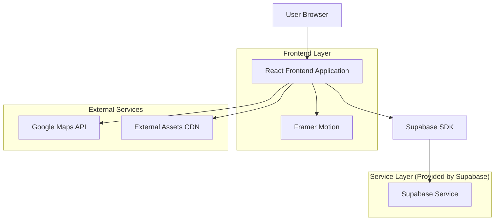
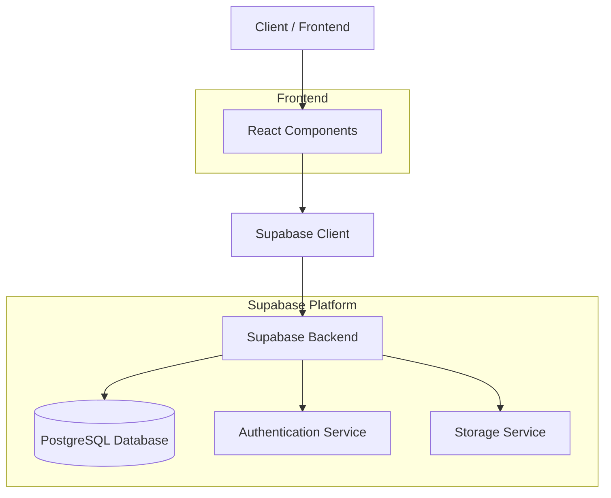
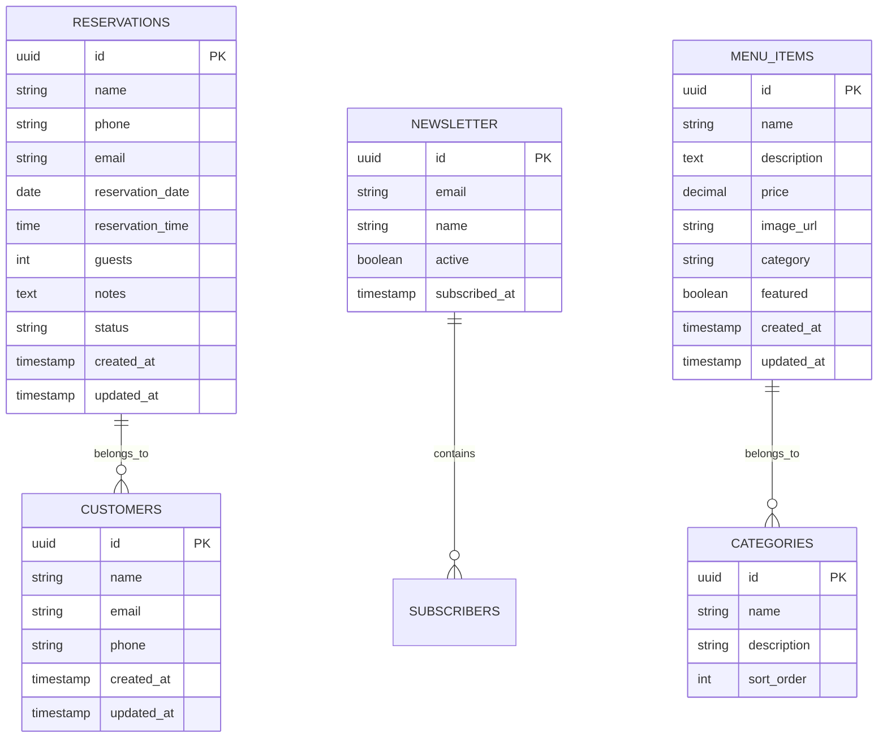

# Cafeteria Dev - Arquitetura Técnica

## 1. Architecture design



## 2. Technology Description

* **Frontend:** React\@18 + TypeScript + Tailwind CSS\@3 + Vite

* **Animations:** Framer Motion\@10 para carrosséis e transições

* **Maps:** Google Maps JavaScript API para integração de mapas

* **Backend:** Supabase (autenticação, banco de dados, storage)

* **Styling:** Tailwind CSS com configuração customizada para paleta dourada

* **Icons:** Lucide React + SVGs customizados para ícones de café

* **Fonts:** Google Fonts (Playfair Display, Inter, Cormorant Garamond)

## 3. Route definitions

| Rota          | Propósito                                                                                                |
| ------------- | -------------------------------------------------------------------------------------------------------- |
| /             | Página principal com todas as seções (Hero, Ambiente, Menu, Processo, Experiência, Depoimentos, Contato) |
| /#hero        | Seção Hero com parallax e call-to-action principal                                                       |
| /#ambiente    | Showcase do ambiente com carrossel de imagens                                                            |
| /#menu        | Grid dos cafés mais populares                                                                            |
| /#processo    | Timeline do processo artesanal do café                                                                   |
| /#experiencia | Experiência sensorial com layout dividido                                                                |
| /#depoimentos | Slider de depoimentos de clientes                                                                        |
| /#contato     | Formulário de reserva e mapa integrado                                                                   |

## 4. API definitions

### 4.1 Core API

**Reservas de Mesa**

```
POST /api/reservations
```

Request:

| Nome do Parâmetro | Tipo   | Obrigatório | Descrição                     |
| ----------------- | ------ | ----------- | ----------------------------- |
| name              | string | true        | Nome completo do cliente      |
| phone             | string | true        | Telefone para contato         |
| email             | string | true        | Email do cliente              |
| date              | string | true        | Data da reserva (YYYY-MM-DD)  |
| time              | string | true        | Horário da reserva (HH:MM)    |
| guests            | number | false       | Número de pessoas (padrão: 1) |
| notes             | string | false       | Observações especiais         |

Response:

| Nome do Parâmetro | Tipo    | Descrição               |
| ----------------- | ------- | ----------------------- |
| success           | boolean | Status da operação      |
| reservation\_id   | string  | ID único da reserva     |
| message           | string  | Mensagem de confirmação |

Exemplo:

```json
{
  "name": "João Silva",
  "phone": "+55 11 99999-9999",
  "email": "joao@email.com",
  "date": "2024-01-15",
  "time": "14:30",
  "guests": 2,
  "notes": "Mesa próxima à janela, se possível"
}
```

**Newsletter Subscription**

```
POST /api/newsletter
```

Request:

| Nome do Parâmetro | Tipo   | Obrigatório | Descrição             |
| ----------------- | ------ | ----------- | --------------------- |
| email             | string | true        | Email para newsletter |
| name              | string | false       | Nome do assinante     |

Response:

| Nome do Parâmetro | Tipo    | Descrição               |
| ----------------- | ------- | ----------------------- |
| success           | boolean | Status da inscrição     |
| message           | string  | Mensagem de confirmação |

## 5. Server architecture diagram



## 6. Data model

### 6.1 Data model definition



### 6.2 Data Definition Language

**Tabela de Reservas (reservations)**

```sql
-- Criar tabela de reservas
CREATE TABLE reservations (
    id UUID PRIMARY KEY DEFAULT gen_random_uuid(),
    name VARCHAR(100) NOT NULL,
    phone VARCHAR(20) NOT NULL,
    email VARCHAR(255) NOT NULL,
    reservation_date DATE NOT NULL,
    reservation_time TIME NOT NULL,
    guests INTEGER DEFAULT 1 CHECK (guests > 0 AND guests <= 20),
    notes TEXT,
    status VARCHAR(20) DEFAULT 'pending' CHECK (status IN ('pending', 'confirmed', 'cancelled', 'completed')),
    created_at TIMESTAMP WITH TIME ZONE DEFAULT NOW(),
    updated_at TIMESTAMP WITH TIME ZONE DEFAULT NOW()
);

-- Criar índices
CREATE INDEX idx_reservations_date ON reservations(reservation_date);
CREATE INDEX idx_reservations_email ON reservations(email);
CREATE INDEX idx_reservations_status ON reservations(status);

-- Permissões Supabase
GRANT SELECT ON reservations TO anon;
GRANT ALL PRIVILEGES ON reservations TO authenticated;
```

**Tabela de Newsletter (newsletter)**

```sql
-- Criar tabela de newsletter
CREATE TABLE newsletter (
    id UUID PRIMARY KEY DEFAULT gen_random_uuid(),
    email VARCHAR(255) UNIQUE NOT NULL,
    name VARCHAR(100),
    active BOOLEAN DEFAULT true,
    subscribed_at TIMESTAMP WITH TIME ZONE DEFAULT NOW()
);

-- Criar índices
CREATE INDEX idx_newsletter_email ON newsletter(email);
CREATE INDEX idx_newsletter_active ON newsletter(active);

-- Permissões Supabase
GRANT SELECT ON newsletter TO anon;
GRANT ALL PRIVILEGES ON newsletter TO authenticated;
```

**Tabela de Itens do Menu (menu\_items)**

```sql
-- Criar tabela de itens do menu
CREATE TABLE menu_items (
    id UUID PRIMARY KEY DEFAULT gen_random_uuid(),
    name VARCHAR(100) NOT NULL,
    description TEXT,
    price DECIMAL(10,2) NOT NULL,
    image_url VARCHAR(500),
    category VARCHAR(50) NOT NULL,
    featured BOOLEAN DEFAULT false,
    created_at TIMESTAMP WITH TIME ZONE DEFAULT NOW(),
    updated_at TIMESTAMP WITH TIME ZONE DEFAULT NOW()
);

-- Criar índices
CREATE INDEX idx_menu_items_category ON menu_items(category);
CREATE INDEX idx_menu_items_featured ON menu_items(featured);

-- Dados iniciais
INSERT INTO menu_items (name, description, price, category, featured) VALUES
('Espresso Dev', 'Blend especial de grãos torrados artesanalmente com notas de chocolate amargo e caramelo', 8.50, 'espresso', true),
('Latte Code', 'Espresso suave com leite vaporizado e arte latte personalizada', 12.00, 'latte', true),
('Cappuccino Premium', 'Espresso intenso com espuma cremosa e toque de canela', 10.50, 'cappuccino', true),
('Cold Brew Dark Mode', 'Café extraído a frio por 12 horas, servido gelado com notas cítricas', 14.00, 'cold_brew', true);

-- Permissões Supabase
GRANT SELECT ON menu_items TO anon;
GRANT ALL PRIVILEGES ON menu_items TO authenticated;
```

**Trigger para atualização automática de timestamps**

```sql
-- Função para atualizar updated_at
CREATE OR REPLACE FUNCTION update_updated_at_column()
RETURNS TRIGGER AS $$
BEGIN
    NEW.updated_at = NOW();
    RETURN NEW;
END;
$$ language 'plpgsql';

-- Aplicar trigger nas tabelas
CREATE TRIGGER update_reservations_updated_at BEFORE UPDATE ON reservations FOR EACH ROW EXECUTE FUNCTION update_updated_at_column();
CREATE TRIGGER update_menu_items_updated_at BEFORE UPDATE ON menu_items FOR EACH ROW EXECUTE FUNCTION update_updated_at_column();
```

