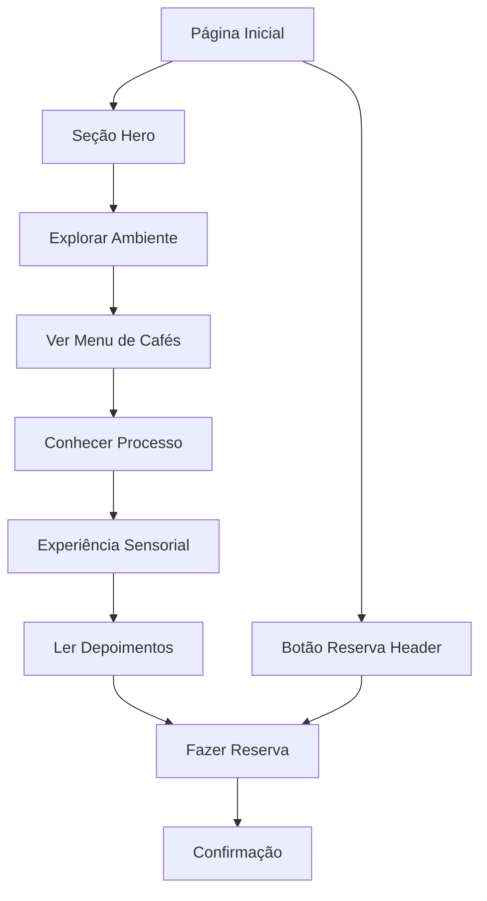

# Cafeteria Dev — Experiência Premium em Cada Gole

## 1. Product Overview

A Cafeteria Dev é uma experiência premium que une sofisticação, tecnologia e o melhor do café artesanal em um ambiente cinematográfico e elegante. Voltada para profissionais criativos, desenvolvedores e amantes de café que valorizam design refinado, sabor excepcional e um espaço inspirador para trabalhar e relaxar.

O projeto visa criar um espaço de alto padrão que transmita exclusividade através de um design dark e minimalista, oferecendo não apenas café de qualidade superior, mas uma experiência sensorial completa que desperta criatividade e produtividade.

## 2. Core Features

### 2.1 User Roles

| Papel | Método de Acesso | Principais Funcionalidades |
|-------|------------------|----------------------------|
| Visitante | Acesso direto ao site | Navegar pelo menu, conhecer o ambiente, visualizar processo do café |
| Cliente Interessado | Formulário de contato/reserva | Fazer reservas, solicitar informações, acessar localização |
| Cliente Fidelizado | Newsletter/redes sociais | Receber novidades, promoções especiais, eventos exclusivos |

### 2.2 Feature Module

Nossa plataforma da Cafeteria Dev consiste nas seguintes páginas principais:

1. **Página Principal (Home)**: header fixo elegante, seção hero com parallax, showcase do ambiente, menu de cafés populares, processo artesanal, experiência sensorial, depoimentos de clientes, formulário de reserva e footer sofisticado.

### 2.3 Page Details

| Nome da Página | Nome do Módulo | Descrição da Funcionalidade |
|----------------|----------------|----------------------------|
| Página Principal | Header Fixo | Exibir logo minimalista, menu de navegação animado (Home, Menu, Experiência, Processo, Ambientes, Contato), botão de reserva com borda dourada e animação de brilho |
| Página Principal | Seção Hero | Apresentar imagem de fundo em alta definição com barista preparando café, texto principal "O Café que Desperta Experiências", subtexto inspirador, botões de call-to-action, efeito parallax no scroll |
| Página Principal | Ambiente e Experiência | Mostrar carrossel de imagens do interior da cafeteria, título inspirador, ícones elegantes com benefícios (Wi-Fi, doces artesanais, trilha sonora, espaço para freelancers) |
| Página Principal | Os Mais Pedidos | Exibir grade de 4 colunas com cafés premium (Espresso Dev, Latte Code, Cappuccino Premium, Cold Brew Dark Mode), incluir fotos em alta definição, descrições elegantes, preços e botões de detalhes |
| Página Principal | Processo do Café | Ilustrar 4 etapas horizontais do processo (Seleção dos Grãos, Torra Artesanal, Moagem de Precisão, Extração Perfeita), incluir ícones minimalistas, animações fade-in, fundo com partículas de café |
| Página Principal | Experiência Sensorial | Apresentar layout dividido com close do café sendo servido, texto descritivo sobre aroma e sabor, botão "Prove agora" com transição dourada |
| Página Principal | Depoimentos | Exibir slider automático com citações de clientes, fotos em preto e branco, tipografia refinada sobre fundo marrom escuro |
| Página Principal | Contato e Reserva | Fornecer formulário minimalista (nome, telefone, email, data, horário), botão dourado de confirmação, mapa integrado do Google Maps em modo escuro |
| Página Principal | Footer Elegante | Mostrar informações organizadas em colunas (sobre, horários, contato), ícones dourados animados das redes sociais, frase de marca inspiradora |

## 3. Core Process

**Fluxo Principal do Usuário:**

O usuário acessa a página inicial e é imediatamente impactado pela seção hero cinematográfica com o barista preparando café. Ele navega pelo menu fixo para explorar diferentes seções: conhece o ambiente através do carrossel de imagens, descobre os cafés mais populares na grade visual, aprende sobre o processo artesanal em 4 etapas, vivencia a experiência sensorial através do layout dividido, lê depoimentos de outros clientes e, finalmente, faz uma reserva através do formulário de contato integrado com mapa.

**Fluxo de Reserva:**
O cliente interessado clica no botão "Reserve sua mesa" no header ou "Agende sua experiência" na seção hero, é direcionado para a seção de contato, preenche o formulário com seus dados e preferências de data/horário, confirma a experiência através do botão dourado e recebe feedback visual de confirmação.

## 4. User Interface Design

### 4.1 Design Style

**Paleta de Cores:**
- Primária: Preto (#000000) e Marrom Profundo (#2D1B14)
- Secundária: Dourado Suave (#D4AF37) e Tons de Cobre (#B87333)
- Acentos: Dourado Brilhante (#FFD700) para highlights e animações

**Estilo de Botões:**
- Bordas douradas com cantos levemente arredondados
- Efeitos de hover com brilho sutil e transições suaves
- Animações de glow dourado em elementos interativos

**Tipografia:**
- Títulos: Playfair Display (serif moderna) - tamanhos 48px-72px para headers principais
- Texto: Inter (sans-serif refinada) - tamanhos 16px-18px para corpo do texto
- Destaques: Cormorant Garamond para citações e elementos especiais

**Layout:**
- Design clean e minimalista com amplo uso de espaço em branco
- Cards elegantes com sombras sutis e bordas douradas
- Navegação top fixa com transparência e blur effect
- Grid responsivo com breakpoints otimizados

**Ícones e Elementos:**
- SVGs minimalistas personalizados para café e elementos relacionados
- Emojis elegantes: ☕ 🍰 🎧 💻 para destacar benefícios
- Animações de partículas de café e vapor para elementos interativos

### 4.2 Page Design Overview

| Nome da Página | Nome do Módulo | Elementos de UI |
|----------------|----------------|-----------------|
| Página Principal | Header | Fundo preto translúcido com blur, logo dourada minimalista, menu horizontal com hover dourado, botão de reserva com borda dourada pulsante |
| Página Principal | Seção Hero | Background full-screen com overlay escuro, tipografia Playfair Display em dourado, botões com gradiente dourado, efeito parallax suave |
| Página Principal | Ambiente | Cards com bordas douradas sutis, carrossel com transições fade, ícones SVG dourados, texto Inter em branco sobre fundo preto fosco |
| Página Principal | Menu de Cafés | Grid 4 colunas responsivo, cards com hover effect, imagens com overlay dourado, preços em destaque com fonte Playfair Display |
| Página Principal | Processo | Timeline horizontal com conectores dourados, ícones minimalistas em SVG, animações fade-in sequenciais, fundo com partículas animadas |
| Página Principal | Experiência Sensorial | Layout split 50/50, imagem com filtro warm, texto em Cormorant Garamond, botão com transição dourada expansiva |
| Página Principal | Depoimentos | Slider com indicadores dourados, fotos circulares em preto e branco, aspas estilizadas, fundo gradiente marrom escuro |
| Página Principal | Contato | Formulário com inputs minimalistas e bordas douradas, mapa Google Maps em dark mode, botão de confirmação com glow effect |
| Página Principal | Footer | Fundo preto puro, linhas divisórias douradas finas, ícones sociais com hover animation, texto em Inter light |

### 4.3 Responsiveness

O design é **desktop-first** com adaptação cuidadosa para mobile, mantendo a elegância e sofisticação em todas as telas. Inclui otimização para touch interaction em dispositivos móveis, com botões e áreas clicáveis ampliadas. O carrossel e animações são otimizados para performance em dispositivos móveis, mantendo a fluidez da experiência premium.

**Breakpoints principais:**
- Desktop: 1200px+ (experiência completa)
- Tablet: 768px-1199px (layout adaptado)
- Mobile: 320px-767px (stack vertical otimizado)